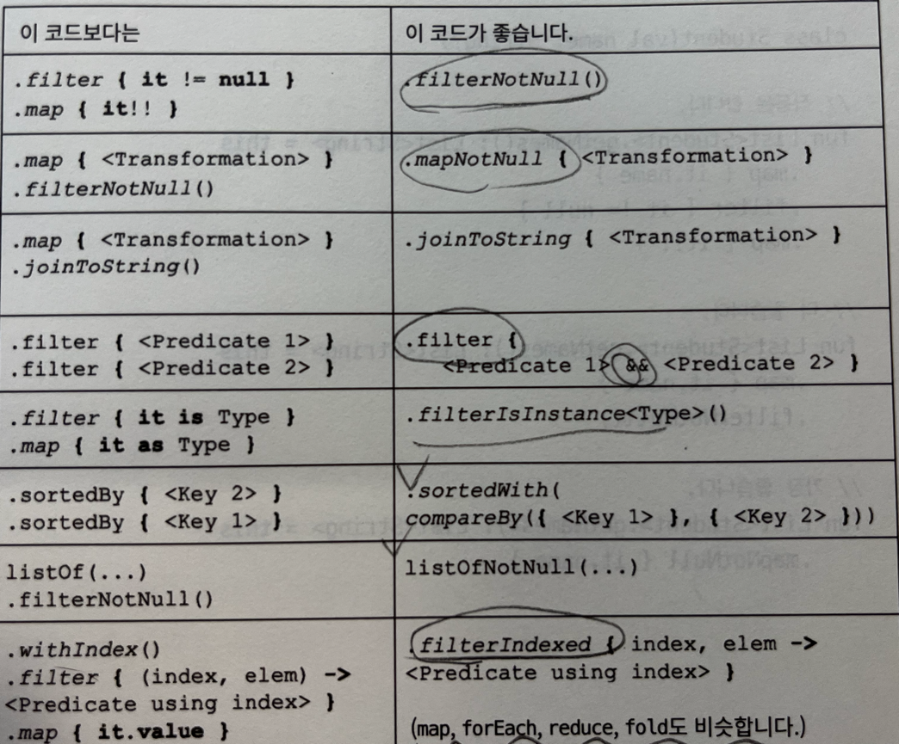

#8장 - 효율적인 컬렉션 처리

---
- item49: 하나 이상의 처리 단계를 가진 경우에는 시퀀스를 사용하라.
  - Sequence 는 지연처리 된다.
  - 최종적인 계싼은 toList, count 등의 최종 연산이 이루어질 때 수행됨.
  - Sequence: 요소 하나하나에 지정한 연산을 한꺼번에 적용
    - element-by-element order 또는 lazy order 라고 부름
    - 고전적인 반복문과 조건문을 사용하면 시퀀스 처리와 동일함.
  - iterable: 요소 전체를 대상으로 연산을 차근차근 적용
    - step-by-step order 또는 eager order 라고 부름
  - 파일같은 경우에 userLines 를 사용하면 Sequence<String> 형태로 파일을 사용할 수 있음.
  - 빠르지 않는 경우도 존재함
    - 유일한 예로 코틀린 stdlib 의 sorted 가 있음.
      - sorted 는 Sequence 를 List 로 변한한 뒤에, 자바 stdlib 의 sort 를 사용해 처리함.
  - 자바 Stream
    - 자바 8 부터 컬렉션 처리를 위해 스트림 기능이 추가됨
    - lazy 하게 동작하고, 마지막 처리 단계에서 연산이 일어남.
  - 코틀린 Sequence 와 자바 Stream 의 차이
    - 코틀린 시퀀스가 더 많은 처리 함수를 갖고 있음.
      - 확장 함수를 사용해서 정의되어 있으므로..
    - 코틀린 시퀀스가 사용하기 더 쉽다.(문법차이같은..)
      - 자바: collect(Collectors.toList()) => 코틀린: toList()
    - 코틀린 시퀀스는 코틀린/JVM, 코틀린/JS, 코틀린/네이티브 등의 일반적인 모듈에서 모두 사용할 수 있음.
    - 자바 스트림은 코틀린/JVM 에서만 동작하고, 그것도 JVM 이 8 버전 이상일 때만 동작.

---
- item50: 컬렉션 처리 단계 수를 제한하라.
  - 적절한 메서드를 활용해서 컬렉션 처리 단계 수를 제한하는 것이 좋다
  - 어떤 메서드가 있는지 몰라서인 경우가 많다.필요할경우 
    - 
    

---

